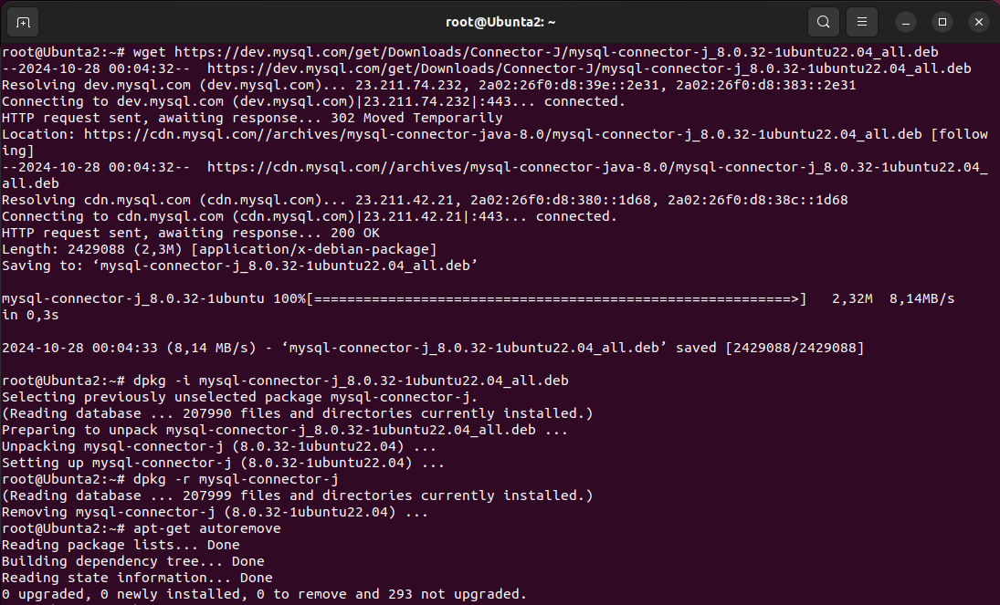

# `Итоговая аттестация. Практическое задание`

## `Информация о проекте`
Необходимо организовать систему учета для питомника, в котором живут домашние и вьючные животные.

## `Задание:`

### 1. Используя команду cat, в терминале операционной системы Linux создать два файла Домашние животные (заполнив файл собаками, кошками, хомяками) и Вьючные животными (заполнив файл лошадьми, верблюдами и ослами), а затем объединить их. Просмотреть содержимое созданного файла. Переименовать файл, дав ему новое имя (Друзья человека).

cat > 'Home pets'

В открывшемся файле указываем
Dogs
Cats
Hamsters

cat > 'Pack animals'

В открывшемся файле указываем
Horses
Camels
Donkeys

cat 'Home pets' 'Pack animals' > "Friends of humans"

ls

mv "Friends of humans" 'Human Friends'

ls

### 2. Создать директорию, переместить файл туда.

mkdir ControlWork

mv 'Human Friends' ControlWork/

ls

### 3. Подключить дополнительный репозиторий MySQL. Установить любой пакет из этого репозитория.

Скачиваем конфигуратор mysql:

su -
wget https://dev.mysql.com/get/mysql-apt-config_0.8.24-1_all.deb

Переходим в папку Загрузки и устанавливаем компоненты mysql с помощью конфигуратора:

dpkg -i mysql-apt-config_0.8.24-1_all.deb

apt-get update

Устанавливаем mysql-server:

sudo apt-get install mysql-server

Проверяем результат установки:

systemctl status mysql

### 4. Установить и удалить deb-пакет с помощью dpkg.

Скачиваем пакет для установки:

wget https://dev.mysql.com/get/Downloads/Connector-J/mysql-connector-j_8.0.32-1ubuntu22.04_all.deb

Устанавливаем пакет mysql-connector-j_8.0.32-1ubuntu22.04_all.deb:

dpkg - i mysql-connector-j_8.0.32-1ubuntu22.04_all.deb

Удаляем пакет и его сопутствующие пакеты:

dpkg -r mysql-connector-j

apt-get autoremove

### 5. Выложить историю команд в терминале ubuntu.

Для получения истории введенных команд в терминале ubuntu используем:

history

### 6. Нарисовать диаграмму, в которой есть класс родительский класс, домашние животные и вьючные животные, в составы которых в случае домашних животных войдут классы: собаки, кошки, хомяки, а в класс вьючные животные войдут: лошади, верблюды и ослы).

